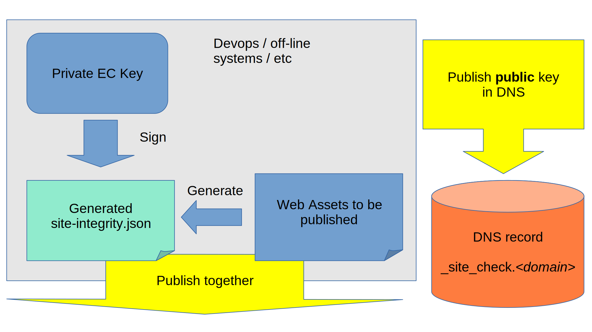

# Site Verifier

The purpose of Site Verifier is to allow the client browser to verify
the integrity of the site assets prior to allowing their execution or
inclusion in the website. This allows for validation of published assets
vis-à-vis the intended assets to be published by the site owner,
enabling secure publishing on not-100% secured resources.

## Problem

In the past, most of the processing and presentation for the web
occurred either on the web server or was static. Data was always sent to
the server supplying the web assets.

### Intended Audience

Every web application that is static or intended to be static can be
cryptographically signed and later validated. This includes **Single Page
Applications (SPA)** and websites that are **static** after publication.

Web applications that generate HTML or JavaScript or similar, are not
target for this technology due to their dynamic nature.

## Mode of Operation

There are two sides of the process. One is for signing the assets and
the other is for verification. First, let's look the signing and
publication process.

### Signing and publication



The process to generate signed web assets is as follows.

1. Generate private EC key, if you don't have one.
2. Generate a public EC key and publish it in your DNS, if not already
   done.
3. Fetch a tarball of your web assets that are to be published and
   generate an new or updated `site-integrity.json` file.
4. Sign the `site-integrity.json` with the private key and publish it
5. Publish your new or updated web assets as normal.


EC keys are chosen because they are smaller size that allow for easier
inclusion in a DNS record. You can generate any key that is supported by
ECDSA, but this is generally limited to approved NIST curves, P-256,
P-384, P-521. To use the enclosed tools, the private key should be
stored in *PKCS#8* format as DER and the public key in also in *SPKI*
(Subject Public Key Info) format as DER.

In the examples below I'll use P-256 (since it's smallest bitspace so has
smallest keys, but another standard curve can be used)

```SH
openssl ecparam -genkey -name P-256 -out private.pem
openssl pkcs8 -in private.pem -outform DER -topk8 -nocrypt -out private.der
openssl ec -in private.pem -outform DER -pubout -out public.der
base64 -w 0 < public.der > public.dns
```

Now the `public.dns` will contain the key that should be placed in the
TXT record of your domain under hostname `_site_check`. You should use
longer caching times as this should not be changed often. So for
example, 24h cache (one line)

```DNS
   _site_check  86400  IN  TXT MFkwEwYHKoZIzj0CAQYIKoZIzj0DAQcDQgAEM1x7Qtu9tIDQqa6mIkJLbpVokZ6ENOfYhykZr1lcxFJ9/Yl0qQ62pEWb+wzm9lBUmGDvc/F/oOpXQ+T2PFGHxg==
```

NOTE: There can be more than 1 key in separate TXT record.

For the purposes of this example, let's use the excellent [Element
Web](https://github.com/vector-im/element-web). We get a tarball that we
want to deploy, check it's valid, sign it and deploy it.

```BASH
> wget https://github.com/vector-im/element-web/releases/download/v1.10.0/element-v1.10.0.tar.gz.asc

> gpg --verify element-v1.10.0.tar.gz.asc
gpg: assuming signed data in 'element-v1.10.0.tar.gz'
gpg: Signature made Mon 31 Jan 2022 04:07:03 PM CET
gpg:                using RSA key E95B7699E80B68A9EAD9A19A2BAA9B8552BD9047
gpg:                issuer "releases@riot.im"
gpg: Good signature from "Element Releases <releases@riot.im>" [unknown]
gpg: WARNING: This key is not certified with a trusted signature!
gpg:          There is no indication that the signature belongs to the owner.
Primary key fingerprint: 712B FBEE 92DC A452 52DB  17D7 C7BE 97EF A179 B100
     Subkey fingerprint: E95B 7699 E80B 68A9 EAD9  A19A 2BAA 9B85 52BD 9047

> zcat element-v1.10.0.tar.gz | node archiveSigner.mjs site-integrity.json 1
```

The `archiveSigner.mjs` requires a tarball as its input on STDIN. It
then goes through all the files and generates SHA-256 checksums for each
of them into the generated `site-integrity.json`. Eventually this JSON
is signed with the `private.der` key generated previously.


### Site verification after deployment

When going to the site, the exenstion will attempt to download
`/.well-known/site-integrity.json`. When successful, it will then try to
fetch the keys by looking for `_site_check` on the current FQDN followed
by all.

CAVEAT: Currently the web browser support for DNS requests seems rather
limited. To allow for full request types, the extension uses DoH
(DNS-over-HTTPS).

